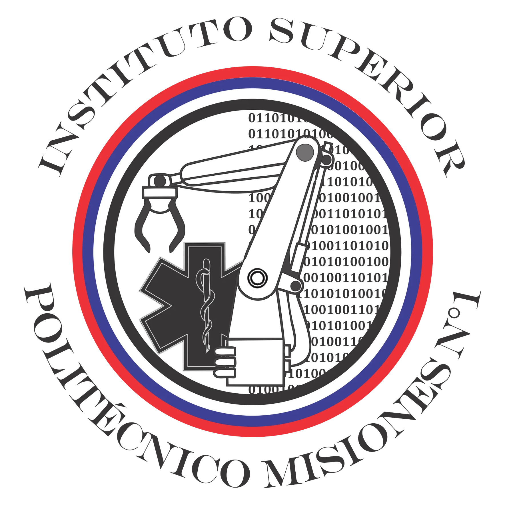

<div align="center">



# 🫀 PEPE — Proyecto Experiencial Para Prácticas de Enfermería

**Maniquí robótico para practicar RCP con retroalimentación en tiempo real**

[](https://www.espressif.com/en/products/socs/esp32)
[](https://platformio.org/)
[](https://www.arduino.cc/)
[](#-estado-del-proyecto)

*Instituto Superior Politécnico Misiones Nro. 1 (ISPM Nro. 1)*
*Tecnicatura Superior en Automatización y Robótica*

</div>

---

**PEPE** (también referenciado en el código como *PEPPE*) es un maniquí robótico pensado para que estudiantes de enfermería practiquen **RCP (Reanimación Cardiopulmonar)** en condiciones realistas y con retroalimentación en tiempo real.

El robot no se limita a detectar las compresiones torácicas: también simula señales clínicas que un/a enfermero/a debe saber evaluar durante una emergencia, como la reacción pupilar a la luz y la aparición de un derrame ocular.

## 📑 Índice

- [¿Qué hace?](#-qué-hace)
- [Estado del proyecto](#-estado-del-proyecto)
- [Hardware](#-hardware)
- [Estructura del repositorio](#-estructura-del-repositorio)
- [Requisitos previos](#-requisitos-previos)
- [Cómo compilar y subir el firmware](#-cómo-compilar-y-subir-el-firmware)
- [Conexión y primer uso](#-conexión-y-primer-uso)
- [App móvil (MIT App Inventor)](#-app-móvil-mit-app-inventor)
- [Solución de problemas](#-solución-de-problemas)
- [Pendientes / notas](#-pendientes--notas)

## ✨ ¿Qué hace?

- **Detección de RCP:** mide la presión y profundidad de las compresiones torácicas mediante un sensor de distancia (VL6180X), y la ventilación (volumen/frecuencia de aire insuflado) mediante un sensor de flujo.
- **Simulación de ojos con pantalla TFT:** los ojos del maniquí se renderizan en una pantalla, con pupilas que reaccionan a la luz que se les apunta (mediante sensores LDR), replicando el reflejo pupilar que se evalúa en una víctima real.
- **Animación de derrame ocular:** el sistema puede activar, de forma programada o aleatoria, una animación de hemorragia/derrame en el ojo, simulando un cuadro clínico adicional que el/la estudiante debe reconocer.
- **Panel del docente:** permite iniciar/detener/reiniciar la práctica, fijar la duración del ejercicio y ver en vivo un gráfico de las compresiones y ventilaciones del alumno.
- **Panel del estudiante:** muestra en tiempo real sus propias métricas durante la práctica.
- **Generación de informes:** al finalizar la práctica se pueden generar reportes con las estadísticas de la sesión (cantidad de compresiones, promedio de tiempo entre ventilaciones, volumen de aire ventilado, etc.).
- **Comunicación en tiempo real:** el ESP32 corre un servidor web + WebSocket, y transmite los datos de sensores a los paneles (docente/estudiante) sobre la red Wi-Fi propia que genera el robot (`PEPPE_001`).

## 🏁 Estado del proyecto

> 🔄 **Funcional — rework en curso**
>
> El robot funciona de punta a punta, pero actualmente estamos mejorando el código y reorganizando el proyecto (limpieza de firmware, orden de carpetas, etc.). Puede haber cambios frecuentes hasta que se estabilice de nuevo.

## 🔧 Hardware

| Componente | Función |
|---|---|
| Microcontrolador **ESP32** | Cerebro del sistema: servidor web, WebSocket y lectura de sensores |
| Sensor de distancia **Adafruit VL6180X** | Mide la profundidad de las compresiones torácicas |
| Sensor de flujo | Mide el volumen/frecuencia de aire insuflado (ventilación) |
| Pantalla **TFT** (librería TFT_eSPI) | Renderiza los ojos del maniquí |
| Sensores **LDR** (izquierdo y derecho) | Detectan cuándo se ilumina cada ojo (reflejo pupilar) |

## 📂 Estructura del repositorio

```
PEPE/
├── platformio.ini          # Configuración de placa y dependencias (PlatformIO)
├── src/                     # Firmware del ESP32
│   ├── main.ino               # Setup, loop, servidor web y websocket
│   ├── funciones.ino           # Lógica de medición de RCP/ventilación
│   └── ojo_funciones.ino       # Lógica de ojos: pupilas, LDR y derrame ocular
├── include/                 # Headers de configuración
│   ├── config.h                # SSID/IP del ESP32, objetos y variables globales
│   ├── ojo_config.h
│   └── serial_json_adapter.h
├── data/                    # Paneles web servidos por el ESP32 (SPIFFS)
│   ├── html/
│   │   ├── index.html            # Login / selección de rol
│   │   ├── panelDocente.html
│   │   ├── panelEstudiante.html
│   │   ├── parametros.html
│   │   ├── generaInforme.html
│   │   ├── ayuda.html
│   │   └── bottom.html
│   ├── CSS/                     # estilos.css, style2.css
│   ├── JS/                      # chart.js y plugins de gráficos
│   └── Images/                  # íconos y assets de los paneles
├── app/
│   └── appRCP.aia            # Proyecto de la app mobile (MIT App Inventor)
├── assets/
│   └── logoPoli.png
├── docs/
│   └── borradores/            # HTML sueltos que no usa el firmware actualmente
└── README.md
```

---

## ✅ Requisitos previos

- **Visual Studio Code** instalado.
- Extensión **PlatformIO IDE** instalada en VS Code (se instala desde el ícono de Extensiones, buscando "PlatformIO IDE").
- Cable USB para conectar la placa ESP32.
- Driver USB-to-Serial correspondiente a la placa (CP2102 o CH340, según el modelo) instalado en el sistema.

## ⚙️ Cómo compilar y subir el firmware

Este proyecto usa [PlatformIO](https://platformio.org/) (extensión de VS Code), que se encarga de instalar automáticamente las librerías y el toolchain del ESP32.

1. Instalar la extensión **PlatformIO IDE** en VS Code (si no la tenés, buscala en el panel de Extensiones e instalala; puede tardar unos minutos en configurarse la primera vez).
2. Abrir esta carpeta del proyecto en VS Code (`File > Open Folder...`).
3. Esperar a que PlatformIO detecte el `platformio.ini` e instale automáticamente el framework de ESP32 y las librerías declaradas en `lib_deps` (se ve un ícono de progreso abajo a la izquierda). No hace falta instalar nada manualmente.
4. Conectar la placa ESP32 a la PC por USB.
5. Desde el ícono de PlatformIO (la "hormiga" en la barra lateral) o por terminal, compilar y subir el firmware:
   ```
   pio run --target upload
   ```
6. Subir los archivos del panel web (carpeta `data/`) al sistema de archivos del ESP32:
   ```
   pio run --target uploadfs
   ```
7. (Opcional) Abrir el monitor serie para ver los logs del ESP32:
   ```
   pio device monitor
   ```

> Los pasos 5 y 6 son independientes: el firmware (código) y los archivos del panel web (SPIFFS) se suben por separado. Si solo cambiás HTML/CSS/JS de `data/`, alcanza con repetir el paso 6.

## 📶 Conexión y primer uso

Al encender la placa, el ESP32 crea su propia red Wi-Fi (no se conecta a internet ni a un router):

| Dato | Valor |
|---|---|
| SSID | `PEPPE_001` |
| Contraseña | `POLITECNICO` |
| IP del servidor | `192.168.10.1` |

Pasos para usarlo:

1. Desde una PC o celular, conectate a la red Wi-Fi **`PEPPE_001`** con la contraseña **`POLITECNICO`**.
2. Abrí un navegador y entrá a **`http://192.168.10.1`**.
3. Vas a ver la pantalla de login/selección de rol (`index.html`), donde se elige entre **Panel Docente** o **Panel Estudiante**.
4. Desde el panel docente se puede iniciar, detener o reiniciar la práctica y definir la duración del ejercicio.
5. Desde el panel estudiante se ven en vivo las métricas de la propia práctica (compresiones, ventilaciones, etc.).
6. Al finalizar, se puede generar un informe con las estadísticas de la sesión desde `generaInforme.html`.

## 📱 App móvil (MIT App Inventor)

En `app/appRCP.aia` está el proyecto fuente de una app complementaria, hecha con [MIT App Inventor](https://appinventor.mit.edu/). Para editarla:

1. Entrar a [ai2.appinventor.mit.edu](https://ai2.appinventor.mit.edu/).
2. `Projects > Import project (.aia) from my computer` y seleccionar `app/appRCP.aia`.

---

## 🛠️ Solución de problemas

- **No aparece la red `PEPPE_001`:** confirmar que el firmware se subió correctamente (`pio run --target upload`) y que la placa tiene alimentación estable (el ESP32 puede resetearse con fuentes USB débiles).
- **La página `192.168.10.1` no carga o muestra error 404 en los paneles:** falta subir el sistema de archivos (`pio run --target uploadfs`); el firmware y los archivos de `data/` se suben por separado.
- **Error de compilación relacionado a `TFT_eSPI`:** esta librería necesita su propio archivo de configuración de pines (`User_Setup.h`) o `build_flags` en `platformio.ini`. Ver la nota en [Pendientes / notas](#-pendientes--notas).
- **El puerto serie no aparece en PlatformIO:** instalar el driver USB-to-Serial correspondiente al chip de la placa (CP2102 o CH340) y volver a conectar el cable.

## 📝 Pendientes / notas

- Confirmar en `platformio.ini` el modelo exacto de placa ESP32 usado (actualmente configurado como `esp32dev` genérico).
- Si se usa una configuración custom de pines para la pantalla TFT (`TFT_eSPI`), agregar el `User_Setup.h` correspondiente o los `build_flags` en `platformio.ini`.
- La carpeta `docs/borradores/` tiene un par de HTML (`index_.html`, `head-content.html`) que no están conectados al firmware — quedaron ahí por si se recicla contenido, se pueden borrar si no hacen falta.

---

<div align="center">

### 👨‍🎓 Autores

Proyecto desarrollado por alumnos de 2° año de la **Tecnicatura Superior en Automatización y Robótica**
**Instituto Superior Politécnico Misiones Nro. 1**

</div>
